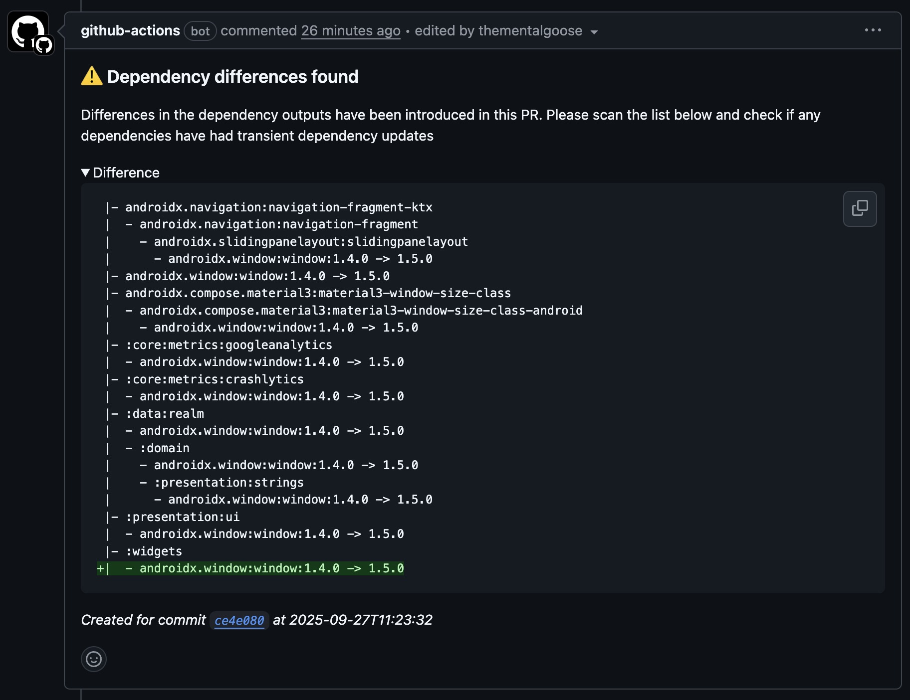

# Gradle Dependency Diff

 [](https://github.com/thementalgoose/gradle-dependency-diff/actions/workflows/release.yml)

> Help spot transitive dependency updates across the project

A small github action designed for android projects which will analyse the gradle dependency graph of a base branch and a target branch and highlight any differences between the two. 

### Setup

```yml
# This action
# =================================================
#  Generate the diff
- name: Generate dependency diff
  id: diff
  uses: thementalgoose/gradle-dependency-diff@v1
  with:
    before: before.txt
    after: after.txt
    output_to_file: true
    output_to_file_name: diff.txt
```



### Parameters

#### Inputs

| Input | Required | Default | Info |
|---|---|---|---|
| `before` | true | | Relative path to a file that holds the output of the original dependency output |
| `after` | true | | Relative path to a file that holds the output of the new dependency output |
| `output_to_file` | false | `false` | Output the diff to a file |
| `output_to_file_name` | false | `diff.txt` | The file name that the output diff is saved too. Only generated if output_to_file is true | 

#### Outputs

| Output | Type | Info |
|---|---|---|
| `is_difference_found` | boolean | If a dependency difference was found | 
| `difference` | string | Dependency difference output |

### Usage 

```yml
# Optional:
# =================================================
#  If running inside a pull request, generate the dependency
#  outputs of previous state by checking out the base ref,
#  generating the report and then change back to the head ref
#  and generate that report in two different files
- name: Checkout base branch + generate report
  run: |
    git checkout ${{ github.base_ref }}
    ./gradlew :app:dependencies --configuration liveReleaseRuntimeClasspath >> before.txt

- name: Checkout head branch + generate report
  run: |
    git checkout ${{ github.head_ref }}
    ./gradlew :app:dependencies --configuration liveReleaseRuntimeClasspath >> after.txt

# This action
# =================================================
#  Generate the diff
- name: Generate dependency diff
  id: diff
  uses: thementalgoose/gradle-dependency-diff@v1
  with:
    before: before.txt
    after: after.txt
    output_to_file: true
    output_to_file_name: diff.txt

# Optional
# =================================================
# Post the report to the pull request via. a comment
#  or use the output_to_file option and archive the file
#  for viewing later
- name: PR comment - Diff found
  uses: mshick/add-pr-comment@v2
  if: ${{ steps.diff.outputs.is_difference_found == 'true' }}
  with:
    message-id: dependency-difference
    message: |
      ### ⚠️ Dependency differences found
      
      Differences in the dependency outputs have been introduced in this PR. Please scan the list below and check if any dependencies have had transient dependency updates
      
      <details> 
      <summary>Difference</summary>

      ```diff
      ${{ steps.diff.outputs.result }}
      ```

      </details> 

      _Created for commit ${{ github.sha }} at ${{ github.event.repository.pushed_at }}_

- name: PR comment - No diff found
  uses: mshick/add-pr-comment@v2
  if: ${{ steps.diff.outputs.is_difference_found != 'true' }}
  with:
    message-id: dependency-difference
    update-only: true
    message: |
      ### ✅ No dependency differences found

- name: Archive dependency diff
  uses: actions/upload-artifact@v4
  with:
    name: dependency-diff
    path: diff.txt
```

### Sample output

Example: I update `androidx.window:window` from 1.4.0 to 1.5.0 in a sample android project

```diff 
 |- androidx.navigation:navigation-fragment-ktx
 |  - androidx.navigation:navigation-fragment
 |    - androidx.slidingpanelayout:slidingpanelayout
 |      - androidx.window:window:1.4.0 -> 1.5.0
 |- androidx.window:window:1.4.0 -> 1.5.0
 |- androidx.compose.material3:material3-window-size-class
 |  - androidx.compose.material3:material3-window-size-class-android
 |    - androidx.window:window:1.4.0 -> 1.5.0
 |- :core:metrics:googleanalytics
 |  - androidx.window:window:1.4.0 -> 1.5.0
 |- :core:metrics:crashlytics
 |  - androidx.window:window:1.4.0 -> 1.5.0
 |- :data:realm
 |  - androidx.window:window:1.4.0 -> 1.5.0
 |  - :domain
 |    - androidx.window:window:1.4.0 -> 1.5.0
 |    - :presentation:strings
 |      - androidx.window:window:1.4.0 -> 1.5.0
 |- :presentation:ui
 |  - androidx.window:window:1.4.0 -> 1.5.0
 |- :widgets
 |  - androidx.window:window:1.4.0 -> 1.5.0
```