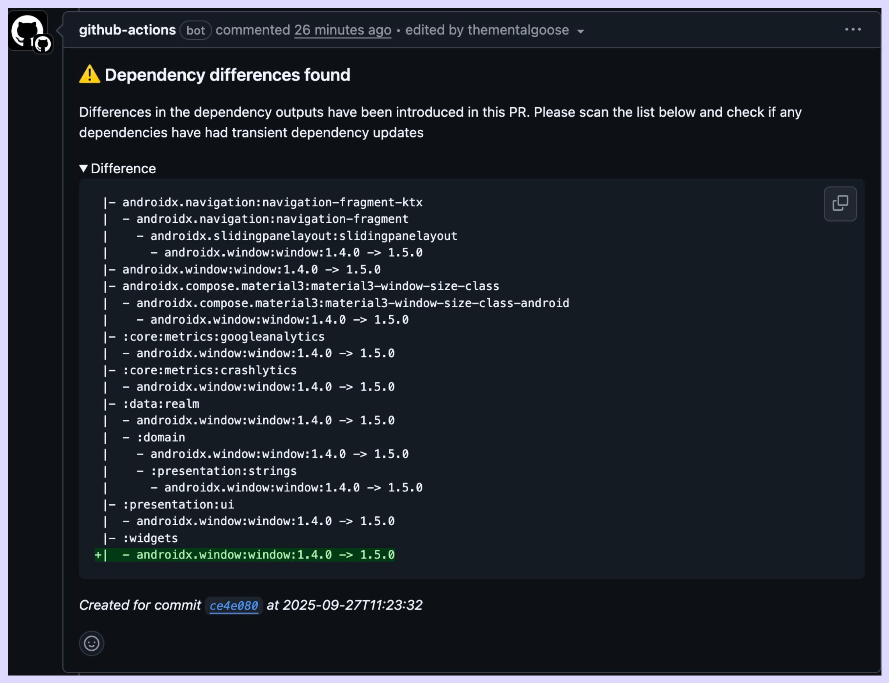

# Gradle Dependency Diff

 [](https://github.com/thementalgoose/gradle-dependency-diff/actions/workflows/release.yml)

> Help spot transitive dependency updates across the project

Gradle projects are built on a tree of dependencies and often have shared transitive dependencies brought in. This small github action is designed for android / gradle projects which will merge the gradle dependency graph of a base branch and a target branch and produce a tree of the differences between the two. This can then be reviewed quickly to see what libraries / dependencies are experiencing updates to see if there's any additional testing needed

### Setup

```yml
- name: Generate dependency diff
  id: diff
  uses: thementalgoose/gradle-dependency-diff@v2
  with:
    before: before.txt
    after: after.txt
    output_to_file: true
    output_to_file_name: diff.txt
    post_pr_comment: true
```



### Parameters

#### Inputs

| Input | Required | Default | Info |
|---|---|---|---|
| `before` | true | | Relative path to a file that holds the output of the original dependency output |
| `after` | true | | Relative path to a file that holds the output of the new dependency output |
| `output_to_file` | false | `false` | Output the diff to a file |
| `output_to_file_name` | false | `diff.txt` | The file name that the output diff is saved too. Only generated if output_to_file is true | 
| `post_pr_comment` | false | `false` | Post Pull Request comment |
| `repo_token` | false | `${{ github.token }}` | Repo token used for posting a comment on pull requests |
| `show_removals` | false | `true` | Show removed dependencies in the diff output |

#### Outputs

| Output | Type | Info |
|---|---|---|
| `is_difference_found` | boolean | If a dependency difference was found | 
| `difference` | string | Dependency difference output |

### Usage 

```yml
# Optional:
# =================================================
#  If running inside a pull request, generate the dependency
#  outputs of previous state by checking out the base ref,
#  generating the report and then change back to the head ref
#  and generate that report in two different files
- name: Checkout base branch + generate report
  run: |
    git checkout ${{ github.base_ref }}
    ./gradlew :app:dependencies --configuration releaseRuntimeClasspath >> before.txt

- name: Checkout head branch + generate report
  run: |
    git checkout ${{ github.head_ref }}
    ./gradlew :app:dependencies --configuration releaseRuntimeClasspath >> after.txt

# This action
# =================================================
#  Generate the diff
- name: Generate dependency diff
  id: diff
  uses: thementalgoose/gradle-dependency-diff@v2
  with:
    before: before.txt
    after: after.txt
    output_to_file: true
    output_to_file_name: diff.txt
    post_pr_comment: true

# Optional
# =================================================
# Archive the difference file outputted from the action 
#  for review later
- name: Archive dependency diff
  uses: actions/upload-artifact@v4
  with:
    name: dependency-diff
    path: diff.txt
```

### Sample output

This example below lists a before + after output of the `./gradlew :dependencies` task and what the generated difference would highlight

| Before | After |
|---|---|
| <pre>- com.squareup.okhttp3:okhttp:4.10.0<br/>  - com.squareup.com.squareup.okio:okio:2.8.0<br/>    - org.jetbrains.kotlin:kotlin-stdlib-common:1.5.0<br/>  - org.jetbrains.kotlin:kotlin-stdlib:1.5.0<br/>    - org.jetbrains.kotlin:kotlin-stdlib-common:1.5.0<br/>- androidx.core:core-ktx:1.7.0<br/>  - androidx.annotation:annotation:1.2.0<br/>  - androidx.core:core:1.7.0<br/></pre> | <pre>- com.squareup.okhttp3:okhttp:4.10.0<br/>  - com.squareup.com.squareup.okio:okio:3.0.0<br/>    - org.jetbrains.kotlin:kotlin-stdlib-common:1.5.0<br/>  - org.jetbrains.kotlin:kotlin-stdlib:1.5.0<br/>    - org.jetbrains.kotlin:kotlin-stdlib-common:1.5.0<br/>    - androidx.annotation:annotation:1.2.0<br/> <br/> <br/></pre> | 

```diff 
 |- com.squareup.okhttp3:okhttp
 |  - com.squareup.okio:okio:2.8.0 -> 3.0.0
 |  - org.jetbrains.kotlin:kotlin-stdlib
+|    - androidx.annotation:annotation:1.2.0
-|- androidx.core:core-ktx:1.7.0
-|  - androidx.annotation:annotation:1.2.0
-|  - androidx.core:core:1.7.0
```